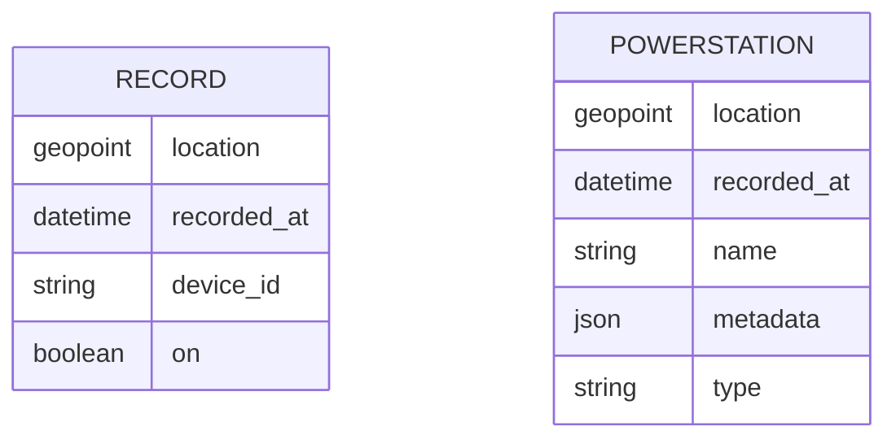

# Entity Relationship Diagram

```mermaid
erDiagram
    RECORD {
        geopoint location
        datetime recorded_at
        string device_id
        boolean on
    }
    POWERSTATION {
        geopoint location
        datetime recorded_at
        string name
        json metadata
        string type
    }
```

Power station types = (SUBSTATION, TRANSFORMER)

# Assumptions / Questions

1. Can we throttle reports from devices e.g. for malicious actors?
